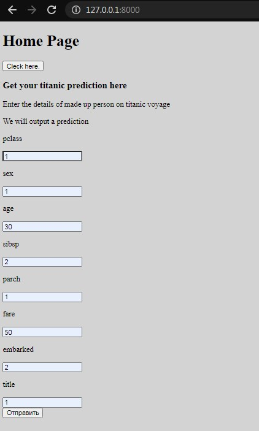
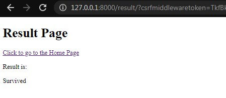

# Django web site with trained machine learning model 
https://github.com/vadimvvlasov/Django-with-machine-learning

In this django project, I have integrated a machine learning model
 for the Kaggle Competition - Titanic: Machine Learning from Disaster.

https://www.kaggle.com/c/titanic

1. Runserver 
    ```python
    python manage.py runserver
    ```
2. Enter parameters
    

3. Get result
    
